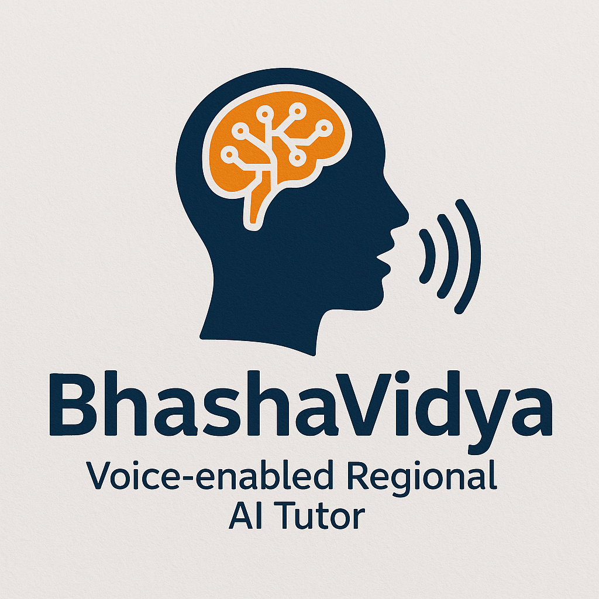

# BhashaVidya - AI-Powered Regional Language Tutor
## Overview

BhashaVidya is an AI-powered application designed to provide learning experiences in regional Indian languages and some European languages. This tool leverages various cutting-edge technologies to offer contextual information on a range of topics in different languages. By using multiple libraries and frameworks, the app can translate, generate speech, recognize speech, and fetch context-based information dynamically in multiple languages. The core goal of the application is to enable users to gain knowledge in regional and European languages effectively and efficiently.

### Features
Contextual Information: BhashaVidya provides context-based information on various topics, translating it into different languages.

Multiple Language Support: Supports multiple regional and European languages like Hindi, Bengali, French, Spanish, etc.

Speech Recognition & Text-to-Speech: Users can interact with the application via voice, and the app can also generate speech in multiple languages.

Real-time Translations: Supports instant translations using multiple translation APIs and libraries.

PDF Content Extraction: Ability to extract content from PDF documents and translate or speak it in the desired language.

### Technologies Used
#### 1. Streamlit
Purpose: Streamlit was used to build the interactive web interface for the application. It allows users to interact with the app seamlessly and display results dynamically.

Features Integrated: The user interface allows for topic selection, language selection, displaying translated text, and generating speech for the selected language.

#### 2. googletrans
Purpose: googletrans is a Python library that uses Google Translate’s API to perform translations. It is used to translate input text from one language to another.

Use in the Project: BhashaVidya uses googletrans to provide translations for different languages and show context-based information in those languages.

#### 3. gTTS (Google Text-to-Speech)
Purpose: gTTS is used to convert the translated text into speech, allowing users to listen to the content in their selected language.

Use in the Project: Once the translated content is ready, gTTS is used to generate the speech output so the app can speak the context in the chosen language.

#### 4. openai
Purpose: OpenAI’s GPT models are used to generate context-based information on various topics, enhancing the application’s ability to provide insightful and relevant details.

Use in the Project: The app queries OpenAI for detailed, contextual responses based on the selected topic, which is then translated and spoken in the target language.

#### 5. httpx
Purpose: httpx is an HTTP client used to make asynchronous requests.

Use in the Project: It is used to handle API calls efficiently, especially when fetching data from remote APIs like OpenAI or Google Translate in a non-blocking way.

#### 6. httpcore
Purpose: httpcore is a low-level HTTP library that powers httpx.

Use in the Project: It enhances the performance of network requests, particularly during the asynchronous processing of translation and context data retrieval.

#### 7. deep_translator
Purpose: The deep_translator library provides an interface to multiple translation engines, including Google Translate, Microsoft Translator, and more.

Use in the Project: This library is used as a fallback and to provide more reliable translations when necessary, ensuring high-quality translations.

#### 8. SpeechRecognition
Purpose: This library is used for speech-to-text conversion, enabling users to speak their queries.

Use in the Project: It allows users to interact with the app using voice, which is then converted into text for translation or context generation.

#### 9. pydub
Purpose: Pydub is used for audio processing.

Use in the Project: It is utilized to adjust the audio output, such as changing the audio format, adjusting volume, or trimming the speech audio generated by gTTS.

#### 10. streamlit_webrtc
Purpose: Streamlit_webrtc is an extension of Streamlit for integrating WebRTC, allowing real-time communication such as video and audio streaming.

Use in the Project: This is used to facilitate real-time communication and interactions with the app, allowing users to listen to the spoken content and even ask questions via voice.

#### 11. pdfplumber
Purpose: pdfplumber is used to extract text from PDF documents.

Use in the Project: The app can process PDFs containing educational content, extract text, and then provide translations or generate contextual explanations.

#### 12. dotenv
Purpose: dotenv is used for managing environment variables.

Use in the Project: It ensures that sensitive information, such as API keys, is not hard-coded into the source code. The API keys for OpenAI, Google Translate, and others are stored securely in .env files and accessed by the app.

### Structure:
This application consists mainly of two tabs, one is the tab that accepts recordings(.wav file) as input/voice input from the user. Real time voice input is one of the features that can be enhanced in this project in the future.
Second tab consists of manual selection of subjects, topics and the languages in which the content should be displayed. It also involves an audio output that explains the content in the chosen language.

### How It Works
User Input: The user selects a topic and a target language through the Streamlit interface.

Context Generation: The app uses OpenAI’s GPT model to fetch detailed information about the selected topic.

Translation: The context is translated into the target language using googletrans or deep_translator.

Speech Generation: The translated text is converted into speech using gTTS, and the app reads the context aloud in the chosen language.

Speech Recognition: If the user asks a question or interacts with the app via voice, SpeechRecognition is used to convert the spoken words into text, which is then processed.

PDF Processing: If a PDF is uploaded, pdfplumber extracts the text and processes it the same way as any regular text input.

### Future Enhancements
Although BhashaVidya currently provides a basic yet effective context-based learning experience, there are numerous improvements that can be made with more resources:

Feedback & Response System: Implement a feedback mechanism where users can rate the context provided, enabling continuous improvement of the app.

Expanded Topic Database: Currently, the app supports a limited set of topics. Expanding the range of topics, incorporating more specialized content, and training the app on a more extensive dataset will make it more useful.

Personalized Learning: Introduce personalized learning features where the app adapts its responses and content based on user preferences and progress.

Advanced Speech Interaction: Improve speech recognition accuracy, add more languages for speech synthesis, and make the interaction more intuitive.

### Installation
#### Clone the repository:
git clone https://github.com/sam23287/BhashaVidya-AI-Powered-Regional-Language-Tutor.git

#### Install the necessary dependencies:
pip install -r requirements.txt

#### Create a .env file and add your API keys (for OpenAI, Google Translate, etc.):
OPENAI_API_KEY=your_openai_api_key
GOOGLE_TRANSLATE_API_KEY=your_google_translate_api_key

#### Run the Streamlit app:
streamlit run app.py

### Contributing:
Feel free to fork this project, contribute by opening issues, or submit pull requests for bug fixes and enhancements. Contributions are welcome!

### License
This project is licensed under the MIT License - see the LICENSE file for details.